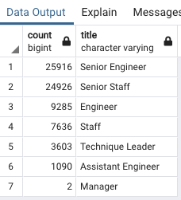

# Pewlett Hackard Analysis

## Overview
As part of planning at Pewlett Hackard (PH), management has asked for experts to look at data in various databases to determine the number of retiring employees, per title, and identify employees who are eligible to participate in a mentorship program. It will require SQL queries to be run. This report summarizes the analysis and helps prepare PH leadership for how to best plan for a large number of current employees who will soon reach retirement age.

## Results
### The number of retiring employees by title
- Through the query and analysis work, it's become clear that there will be many employees retiring soon, with a large percentage having senior-level titles such as Senior Engineer (25,916: 35.7% of the total) and Senior Staff (24,926: 34.4% of the total). For all of the titles, see *Retiring employees by title*, below.

    ##### *Retiring employees by title*
    
- These results especially highlight the need to replace engineer roles, as the "Engineer" and "Senior Engineer" titles represent 48.6% of all the roles retiring soon.

### The employees eligible for the mentorship program
- The analysis work has highlighted that 1,549 employees are eligible for the mentorship program (see *Employees eligible for the mentorship program*, below).

    ##### *Employees eligible for the mentorship program*
    
- There appears to be a good mixture of titles in the list of employees eligible for the mentorship program. This will be important as the company seeks to train new employees, to ensure adequate coverage for each role.

## Summary

### How many roles will need to be filled as the "silver tsunami" begins to make an impact?
After running an additional query, it has again become clear that the total number of employees soon retiring and that will need to be filled is large: 72,458 employees (see *Query* and *Table*, below).

##### *Query*
    

##### *Table*
 

### Are there enough qualified, retirement-ready employees in the departments to mentor the next generation of Pewlett Hackard employees?
Another query was run to determine how meany employees are eligible to mentor the next generation of employees, by title (see *Query* and *Table*, below).

##### *Query*
    

##### *Table*

With 72,458 total employees soon to retire, a calculation was done to determine the ratio of mentors to new hires, by title. This gives a better understanding of the opportunities and gaps for mentoring. Some of the following title areas appear to have adequate mentorship, while others do not:
- Staff: 7,636/427 = 17:1 ratio (IE, 17 new Staff positions per mentor)
- Senior Engineer: 25,916/409 = 63:1 ratio
- Senior Staff: 24,926/297 = 83:1 ratio
- Engineer: 9,285/292 = 31:1 ratio
- Technique Leader: 3,603/77 = 46:1 ratio
- Assistant Engineer: 1,090/47 = 23:1 ratio
- Manager: 2/0 = No managers available to mentor

